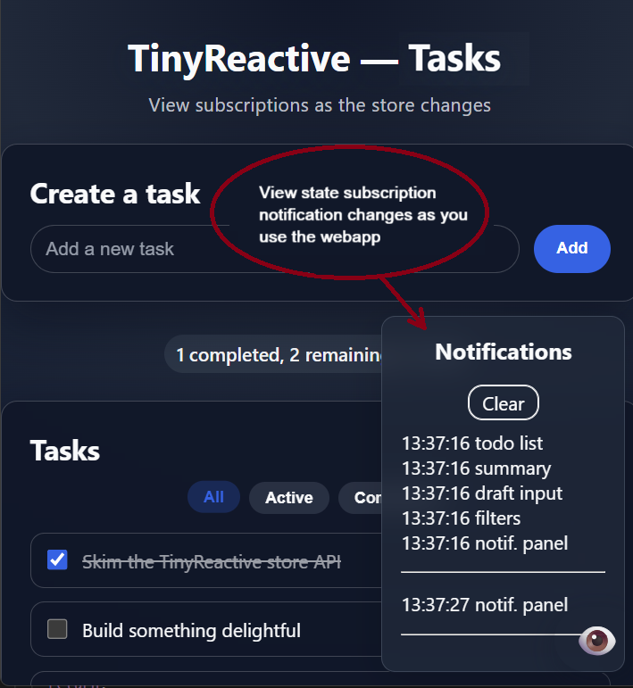

# tinyReactive

A simple, efficient, and robust reactive data store to help write decoupled code. It doubles as a learning resource through the provided samples you can run from the GitHub demos or your local clone.

A typical case is in frontend development between UI and data dependencies: With a reactive store, UI components describe **what** slice of data they care about, the store notifies them **when** that slice changes, and the UI automatically updates just what it needs, keeping the logic encapsulated on each component.

## Highlights
- Updates only the UI affected by a state change.
- No virtual DOM or browser dependency, can be used for UI-less scenarios, for example subscribing to online status for background sync.
- Allows UI subscribers to use existing DOM nodes instead of recreating the component HTML.
- Batches consecutive updates on the next frame draw (or microtask when outside the browser.)
- Subscribers always receive a settled state.
- Works with `import`, `require`, or a `<script>` tag.
- No runtime dependencies.
- Core store logic is about 100 lines of code (≈700 B minified and gzipped).

It's meant to stay small, for simple and medium-complexity scenarios. For larger-scale frameworks with similar store concepts see [Solid](https://www.solidjs.com/tutorial/introduction_signals), [Preact signals](https://preactjs.com/blog/signal-boosting/), [Vue](https://vuejs.org/guide/introduction.html) etc. 

Used in production by [tutorforme.org](https://tutorforme.org).

Fun fact: I first created this pattern in 1997 for Microsoft Money UI updates from database changes.

## Table of contents
- [Basics](#basics)
- [Getting started](#getting-started)
- [Usage](#usage)
- [Samples](#samples)
- [Demos](#demos)
- [Contributing](#contributing)
- [License](#license)

## Basics
The store implementation lives in [`src/store.js`](src/store.js) with an ES module wrapper in [`src/store.module.js`](src/store.module.js). The public API is:

```js
const store = createStore(initialState); //returns an object with `get`, `set`, `patch`, and `subscribe`.

store.get(); //returns the latest snapshot of state.
store.set(newState); //replaces the state and queues notifications.
store.patch(partialState); //shallow merges state and queues notifications.
store.subscribe(callback, selector?); //registers a listener. The callback runs immediately with the initial selected value and only runs again when that value changes.
```
Internally, tinyReactive keeps a `Set` of subscribers. Each subscriber caches the last value from its selector, so updates fire only when needed. Notifications are deferred with `requestAnimationFrame` (or `queueMicrotask`/`setTimeout` outside the browser) to ensure all mutations settle before DOM work. Selector or subscriber failures are caught, logged, and unsubscribed so a single bug cannot stall the store or provide an inconsistent state.

## Getting started
You can inspect and debug samples directly from the [demos](#demos) in GitHub Pages, or clone the repo:

```sh
git clone https://github.com/zmandel/tinyreactive.git
cd tinyreactive
```

The project is framework-free; open the minimal demo from your file explorer at `samples/minimal/index.html` directly in your browser (file:// protocol)
For richer examples such as [`samples/tasks-app`](samples/tasks-app/), run a local dev server (`import` modules require using http).

```sh
cd samples/tasks-app
npm install
npm run dev
```

## Usage
Import the store library (`import`, `require`, or a `<script>`) and wire it to your UI code:

```html
<div id="count"></div>
<button>Increment</button>

<script type="module">
  import { createStore } from './src/store.module.js';

  // Create a store with a primitive initial value.
  // Note: for complex states, use objects such as { count: 0, otherProp: true }.
  const store = createStore(0);

  // Subscribe to the entire store, since its just one value.
  // Note: for complex states, use selectors to subscribe to slices: state => state.count (see tasks-app sample)
  store.subscribe(value => {
    document.querySelector('#count').textContent = value;
  });

  document.querySelector('button').addEventListener('click', () => {
    store.set(store.get() + 1);
  });
</script>
```
In this case, the state is just a number primitive. When its an object, it detect changes with an internal shallow object comparison of the selector slice, in `valuesEqual(a,b)`.

## Samples
These `samples` can be run and debugged directly from the [demos](#demos) below.

- [`samples/minimal`](samples/minimal/) wires a counter to UI. The subscription renders the count, and the click handler only sets the new count.
- [`samples/tasks-app`](samples/tasks-app/) View store events from a notification panel (👁️) as state changes propagate to the UI. Independent subscriptions render the lists, summary, filter buttons, and notification panel. Selectors such as `state => state.todos` keep updates targeted to only what changed. 



## Demos
Inspect the running examples directly:

[tinyReactive on GitHub Pages](https://zmandel.github.io/tinyreactive/)

Open the devtools, set breakpoints, and watch how state changes travel through selectors into the UI.

## Contributing
Issues and pull requests are welcome.

## License
This project is licensed under the [MIT License](LICENSE).
